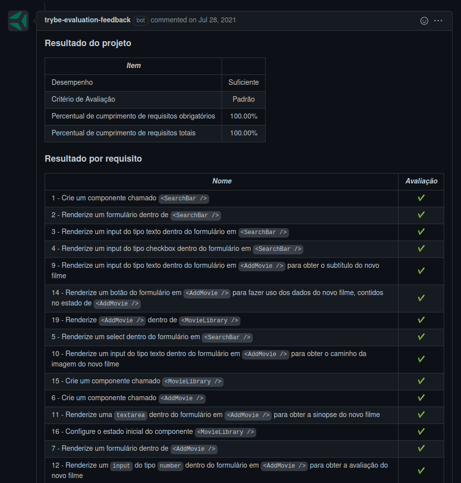
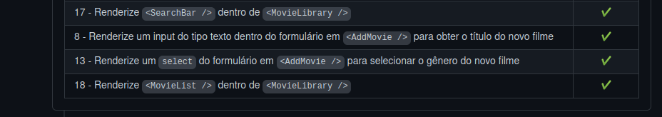

# Welcome to the Movie Cards Library Stateful
## Context

This project was made as a work assignment in during the Trybe web developer course.

The goal was to create a filter for the film list, using the components life cycle knowlegde and states. This same list was developed in another CRUD project, and this one adds the filter possibilities.

---

## How to install

For this project, you will need to have installed:
- NPM

Copy the ssh from the project `git@github.com:luciobj/Project-Movie-Cards-Library-Stateful.git`

* Open a terminal int your machine and type the following commands in order:

  * `git clone git@github.com:luciobj/Project-Movie-Cards-Library-Stateful.git`
  * `cd Project-Movie-Cards-Library-Stateful`
  * `npm install`
  * `npm start`

  The app shoud run on the port 3000, and open a window on you default browser, fully operational.

---

### Technologies

In this project the technology used was mainly React.

---

## Evaluator Results

This is a screenshot of the last run of the Trybe evaluator, which scores the demands of the project.

